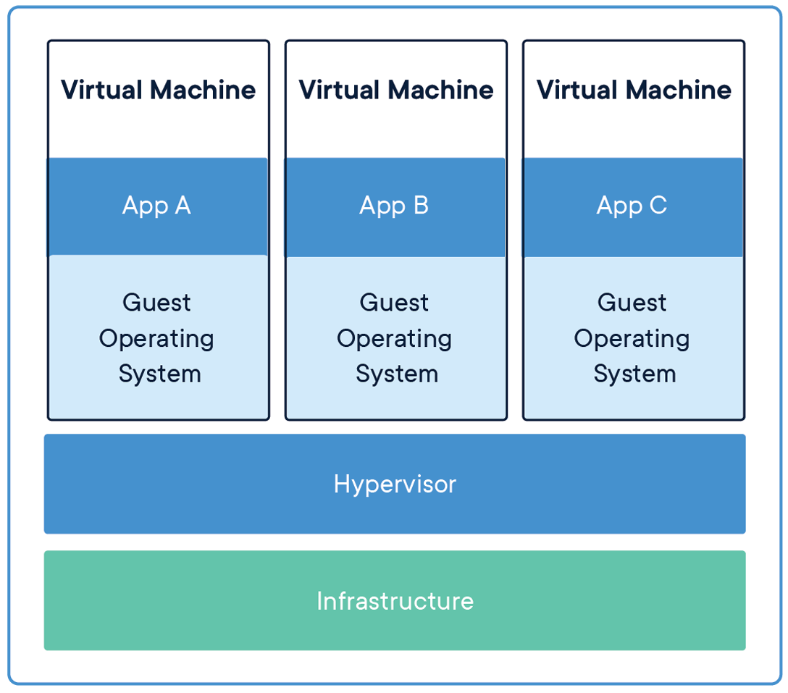

# Overview

> Docker is an open platform for developing, shipping, and running applications with _containers_.

## What is a container?

Containers are an abstraction at the application layer that packages code and dependencies together.

Multiple containers can run on the same machine, called host, and share the OS kernel with other containers, each running as isolated processes in user space.

Fundamentally, a container is nothing but a running process, with some added encapsulation features applied to it in order to keep it isolated from the host and from other containers.

### Difference to Virtual Machines

Virtual machines (VMs) are an abstraction of physical hardware turning one server into many servers. The hypervisor allows multiple VMs to run on a single machine.

Containers and virtual machines have similar resource isolation and allocation benefits, but function differently because containers virtualize the operating system instead of hardware. Containers are more portable and efficient because each VM includes a full copy of an operating system, the application, necessary binaries and libraries - taking up tens of GBs. 

## What is an image?

One of the most important aspects of container isolation is that each container interacts with its own private filesystem; this filesystem is provided by a Docker image.

An image is a read-only template with instructions for creating a Docker container and includes everything needed to run an application - the code or binary, runtimes, dependencies, and any other filesystem objects required. Often, an image is based on another image, and has additional customization. For example, you may build an image which is based on the `ubuntu` image, but installs the Apache web server and your application, as well as the configuration details needed to make your application run.

## Take away

- Containers are running processes.
- Host is the machine where containers runs.
- Images provide the user space to containers.
